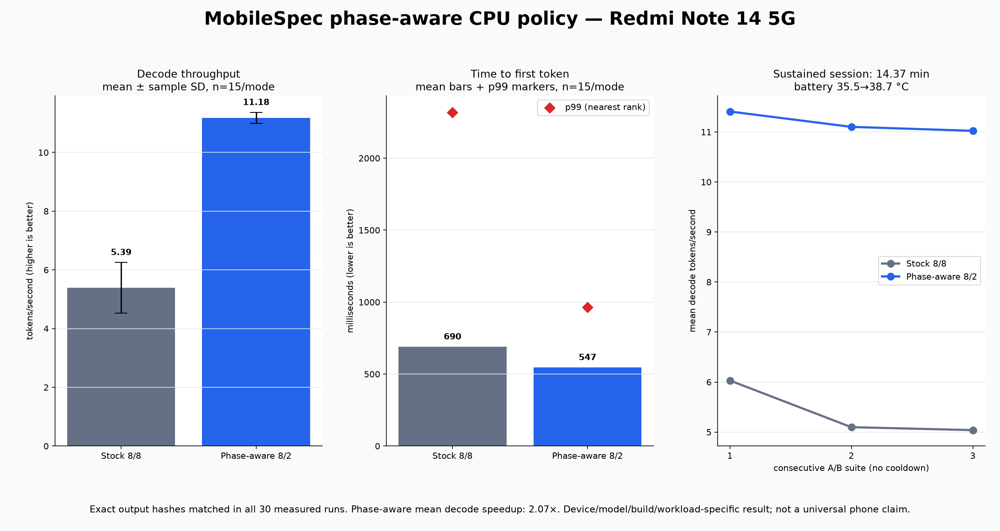

# MobileSpec: evidence-led LLM inference on Android

MobileSpec is an evidence-led llama.cpp optimizer for Arm Android. Its active goal is a phase-aware
CPU policy autotuner: discover heterogeneous CPU topology, measure stock defaults, and select
separate prefill and decode thread policies without promoting noisy or thermally contaminated
results. It is being built for the Mobile AI track of the Arm Create: AI Optimization Challenge
2026.

> **Evidence status (8 August 2026):** Phases 0–2 are measured. Native MTP was slower and used
> swap; the zero-weight n-gram result was rejected because its apparent 2.97x gain came from a
> persistent-cache artifact and its resource gates failed. The topology-derived three-round sweep
> selected `pp8-tg2` over measured stock `pp8-tg8`; all six promotion gates passed. A frozen app
> confirmation and a 14.37-minute no-cooldown session preserved exact output hashes in every pair.
> A final five-run/mode supplement records complete worktree/JNI provenance, 1.76 GB process
> VmHWM, and SwapFree across the scored A/B.
> The result below is a device/model/build/context/workload-specific measurement, not a universal
> Android speedup claim. The demo video and external submission steps remain pending.
> The baseline evidence ends at
> project commit
> `54aabbde5b9c31340f685ba6075a00222b8908f8`; the official Phase 1 bundle was captured at
> `4462c70587f9cdd6d00b67b5964cac060014c7a3`.

## The result so far

The target is a Redmi Note 14 5G with a MediaTek Dimensity 7025: two Cortex-A78 cores, six
Cortex-A55 cores, a PowerVR BXM-8-256 GPU, and 5.6 GB of usable RAM. The benchmark model is
Llama 3.2 1B Instruct Q4_0.

| Question | Measured answer |
|---|---|
| Best official CPU prefill (`pp512`) | **80.04 ± 1.34 tok/s**, 8 threads |
| Best official CPU decode (`tg128`) | **14.16 ± 0.34 tok/s**, 6 threads |
| Does Vulkan help? | No: CPU is 2.0× faster on prefill, 9.4× on decode, and 5.4× on the combined workload |
| Do the two big cores raise peak decode? | No: six A55s alone reach **14.36 ± 0.34 tok/s**, matching the **14.50 ± 0.07 tok/s** unpinned result |
| What limits decode? | Streaming the 729.75 MiB tensor set per token requires about 11.1 GB/s at 14.5 tok/s, already 65–75% of theoretical LPDDR4X peak |
| Did native MTP pass feasibility? | **No.** Across one run of each of three prompts, MTP averaged 4.823 tok/s versus 4.920 tok/s baseline (**0.980×**) despite 37.36% draft acceptance |
| Final synthetic phase pair | **`pp8-tg2`** versus measured stock **`pp8-tg8`**; robust combined score **1.191×**, all six promotion gates passed |
| Frozen real-generation confirmation | **11.52 tok/s optimized vs 6.19 stock**, 5 runs/mode, exact paired output hashes |
| Sustained real generation | **11.18 ± 0.19 tok/s optimized vs 5.39 ± 0.87 stock**, 15 runs/mode over 14.37 min; exact hashes matched |

The central finding is that prefill is compute-heavy while decode is DRAM-bandwidth-bound on this
device. Their measured thread optima differ, so the active optimization is a phase pair:
`n_threads_batch` for prefill and `n_threads` for decode. The winning pair is not a universal
constant; it must be measured for the exact device, model, runtime build, context, and workload.

The complete measured tables and caveats are in
[the official baseline](docs/baseline-results.md) and
[the Phase 2 bottleneck note](docs/bottleneck-note.md).

## Final A/B chart and demo



Across the three consecutive no-cooldown suites, the phase-aware policy averaged **11.178 tok/s**
with **1.71% coefficient of variation**, versus **5.390 tok/s** and **16.10% CV** for stock 8/8.
Mean TTFT improved from **690 ms to 547 ms**; nearest-rank p99 was **2,319 ms vs 965 ms**. With only
15 samples per mode, p99 is the observed maximum and is reported as a tail indicator, not a
population estimate. Battery temperature moved from **35.5 °C to 38.7 °C** and optimized decode
held 11.41, 11.10, and 11.02 tok/s across the three suites.

The demo video URL is still pending recording/upload; no placeholder is presented as a working
demo. Remaining submission actions are tracked in [the Phase 5 checklist](docs/phase5-checklist.md).

## What changed, and why

1. **A reproducible device harness.** Data-driven suites run `llama-bench` over ADB and preserve
   the exact project commit, llama.cpp commit, model hash, configuration, individual samples,
   thermal state, and available memory.
2. **A CPU/Vulkan baseline on real mobile silicon.** Twelve official cases cover a CPU thread
   sweep plus CPU/Vulkan prefill, decode, and combined generation.
3. **A hardware diagnosis, not a guessed optimization.** Affinity experiments, `/proc` thread
   placement sampling, Perfetto, and Vulkan operator checks ruled out big.LITTLE stragglers and
   exposed DRAM saturation plus spin-wait contention.
4. **A topology-derived autotuner.** It discovers CPU clusters, derives thread/affinity candidates,
   measures stock defaults, counterbalances run order, gates on temperature, penalises variance,
   caches profiles, and fails closed when no candidate is trustworthy.
5. **Evidence-first rejection of speculation.** The native-MTP harness compares one Gemma target with
   `--spec-type none` versus the same target plus its MTP head, preserves source/binary/model
   fingerprints, output pairs, acceptance, timing, RSS, swap, ZRAM, battery, and thermal evidence,
   and emits an explicit pass/fail/inconclusive verdict. The device feasibility run completed:
   loading, execution, output equality, and speculation activation passed, but speed and no-swap
   gates failed. The n-gram follow-up was also rejected after its warm-cache confound was identified.
6. **A phase-aware target.** The tuner now measures separate prefill (`n_threads_batch`) and decode
   (`n_threads`) widths and keys the result to the exact device, model, binary/build, context,
   workload, and scoring contract instead of claiming “any model, any device.” The completed
   three-round device sweep selected `pp8-tg2`, embedded the report and binary hashes, and generated
   the Android policy only after all six promotion gates passed.
7. **A verified Android vertical slice.** The Compose app, engine contracts, JNI bridge, benchmark
   export model, telemetry, and model import path build together. On the target phone, SAF model
   import/copy/hash, native load, baseline/optimized generation, five-run counterbalanced A/B,
   exact-output correctness, JSON sharing, cancellation, and post-cancel session reuse all passed.
   Unsupported or stale policies disable optimized mode and retain measured stock defaults.

See [CHANGES_FOR_CHALLENGE.md](CHANGES_FOR_CHALLENGE.md) for the commit-by-commit challenge-window
work.

## Reproduce the committed baseline

### 1. Clone and verify the pins

The repository must be public before submission. Until then, cloning requires repository access.

```bash
git clone --branch agent/phase-aware-autotuner --recurse-submodules \
  https://github.com/ManishModak/llama-edge-android.git
cd llama-edge-android
git submodule update --init --recursive
git -C third_party/llama.cpp rev-parse HEAD
git -C third_party/Vulkan-Headers rev-parse HEAD
```

Expected submodule commits:

```text
178a6c44937154dc4c4eff0d166f4a044c4fceba  third_party/llama.cpp
8864cdc896bbc2a9b6eb36b3218fc9ef57908d77  third_party/Vulkan-Headers
```

### 2. Obtain and verify the benchmark model

Weights are not stored in Git.

```bash
TASK_MODEL_DIR=/absolute/path/to/models
mkdir -p "$TASK_MODEL_DIR"
curl -L \
  -o "$TASK_MODEL_DIR/Llama-3.2-1B-Instruct-Q4_0.gguf" \
  https://huggingface.co/bartowski/Llama-3.2-1B-Instruct-GGUF/resolve/main/Llama-3.2-1B-Instruct-Q4_0.gguf
sha256sum "$TASK_MODEL_DIR/Llama-3.2-1B-Instruct-Q4_0.gguf"
```

Expected SHA-256:

```text
fa0390e7c043f89ae1847bd6682d748041a99d4ef3de0e0b27d33b6af97a8be8
```

The measured file is 773,025,920 bytes. Model licensing is separate from this repository; consult
the Llama 3.2 Community License before use.

### 3. Build, deploy, and run

The recorded Linux build used NDK `28.2.13676358`, CMake `4.3.4`, Ninja `1.13.1`, and
`-march=armv8.2-a+dotprod+fp16`. Exact CPU and Vulkan commands, binary deployment, device
preparation, and result verification are in [docs/reproducibility.md](docs/reproducibility.md).

Once both binaries and the model are under `/data/local/tmp/llama-edge/` on the phone:

```bash
export ANDROID_SERIAL=<phone-serial>
python tools/device_snapshot.py -o /tmp/mobilespec-device.json
python tools/run_suite.py benchmarks/suites/phase1-baseline.json \
  --serial "$ANDROID_SERIAL" \
  --device-snapshot /tmp/mobilespec-device.json \
  --ndk-version 28.2.13676358
python tools/summarize_results.py \
  benchmarks/results/raw/<timestamp>-phase1-baseline
```

This is a 12-case suite with five repetitions per case and a 120-second cooldown between cases.
The committed reference bundle is
`benchmarks/results/raw/20260723-135809-phase1-baseline/`.

### 4. Reproduce the final phase-policy workflow

Apply the pinned benchmark patches, run the topology-derived three-round sweep, and export an APK
policy only if every gate passes:

```bash
python tools/apply_llama_patch.py --apply
python tools/autotune.py --serial "$ANDROID_SERIAL" --force --rounds 3 --cooldown 120 \
  --export-android-policy
```

The promoted reference report is
`benchmarks/results/raw/20260807-232905-autotune/autotune.json` with SHA-256
`7afd9ae000d57bf1bce0e3d38de13d99ffd779a34bbb591f9e41dabffc56a7ab`.
It identifies the exact phone, model, patched benchmark binary, llama.cpp commit, 512-token context,
workload/scoring contract, measured stock widths, every candidate sample, and all gate outcomes.

Rebuild the checked-in real-generation summary and headline chart from the four exported app JSONs:

```bash
MPLCONFIGDIR=/tmp/mobilespec-matplotlib python tools/summarize_real_generation.py \
  --confirmation benchmarks/results/20260807-real-generation/mobilespec-1786126555507.json \
  --sustained \
    benchmarks/results/20260807-real-generation/mobilespec-1786128376471.json \
    benchmarks/results/20260807-real-generation/mobilespec-1786128714979.json \
    benchmarks/results/20260807-real-generation/mobilespec-1786129049935.json \
  --output benchmarks/results/20260807-real-generation/summary.json \
  --chart docs/assets/mobilespec-phase-policy.png
```

Chart generation requires Python 3 plus Matplotlib. Summary validation fails closed if any bundle
has a different identity/config, fewer than five samples per mode, non-native timing, or a failed
exact-output correctness gate.

### Rejected speculative candidates

The selected candidate uses:

| Input | File | Size | SHA-256 |
|---|---|---:|---|
| Gemma 4 E2B QAT target | `gemma-4-E2B-it-qat-UD-Q2_K_XL.gguf` | 2,186,186,784 B | `0a5bbc20f91f92da96ab4870fa71b356c45b8500a7b8b9c3e0eb48359b72da28` |
| Matching MTP head | `mtp-gemma-4-E2B-it.gguf` | 59,235,648 B | `586f2460b909008640981ec34060aa864e03c144fbabfb3173c4335087e4aae0` |

The 2.19 GB target alone is larger than the 1.84 GB `MemAvailable` observed during the earlier
Llama baseline session. That earlier reading included a resident 0.73 GB model, so it is not a
standalone proof of failure, but it makes the on-device no-ZRAM gate decisive.

Validate and preview the end-to-end A/B without a device:

```bash
python tools/apply_llama_patch.py --apply
python tools/apply_llama_patch.py
python tools/run_mtp_ab.py --validate-only
python tools/run_mtp_ab.py --dry-run --cooldown 0
```

An equivalent command for the recorded one-repetition feasibility configuration is:

```bash
python tools/run_mtp_ab.py benchmarks/suites/phase3-mtp.json \
  --repetitions 1 \
  --out-dir benchmarks/results/phase3-feasibility
```

The measured artifact is:

```text
benchmarks/results/phase3-feasibility/20260726-210042-phase3-mtp/mtp-ab.json
sha256: 81e92389437bfe9b02ab7c0b9d5dd41a29f5308bfbbd4711692b4ff114e58932
```

| Feasibility result | Baseline | Native MTP |
|---|---:|---:|
| Mean decode, three prompts | 4.9196 tok/s | 4.8229 tok/s |
| TTFT mean | 3,736 ms | 3,348 ms |
| Successful runs | 3/3 | 3/3 |
| Peak process VmHWM | 2,027,504 kB | 1,902,124 kB |
| SwapFree drop | 450,620 kB | 150,028 kB |

MTP proposed 605 draft tokens and accepted 226 (37.36%). All three greedy outputs matched their
baseline pair exactly, but throughput was only **0.98036×** and both modes used swap. ZRAM device
telemetry was unavailable (`null`), so the no-ZRAM gate was inconclusive; the explicit no-swap and
minimum-1.03× gates failed. This was a feasibility run—one repetition per prompt, starting at
thermal status 2—not a clean-device promotion run. Native MTP is rejected without spending time on
the planned five-repetition confirmation.

## Methodology

- Compare like with like: target model, quantization, context, prompt, sampling, binary, and
  starting device state must match.
- Report all samples, mean, standard deviation, and thermal/memory state. Do not hide failed runs
  or silently discard outliers.
- Use `llama-bench` for controlled prefill/decode policy selection, always including measured stock
  defaults, discarded warm-up, counterbalanced order, thermal gates, and all individual samples.
- Confirm the selected phase pair with real fixed-prompt generation, including TTFT, decode tok/s,
  end-to-end latency, correctness, peak RSS, swap delta, and sustained behavior.
- A throughput win is not accepted if it swaps, changes the target-verification contract, produces
  incoherent output, or disappears under sustained load.

The full protocol is in
[docs/benchmark-methodology.md](docs/benchmark-methodology.md).

## Evidence map

| Artifact | What it proves |
|---|---|
| `benchmarks/results/raw/20260723-135809-phase1-baseline/` | Twelve committed Phase 1 result JSONs with individual samples and provenance |
| `docs/baseline-results.md` | Official CPU thread sweep and CPU-versus-Vulkan interpretation |
| `benchmarks/results/profiles/20260723-105825/` | Phase 2 affinity, placement, Perfetto, correctness, and Vulkan operator evidence |
| `docs/bottleneck-note.md` | DRAM-bound decode diagnosis and rejected workstreams |
| `models/manifest.json` | Model source, quantization, licensing note, and known hashes |
| `docs/phase0-report.md` | First CPU build, deployment, model hash, and coherent smoke generation |
| `benchmarks/results/phase3-feasibility/20260726-210042-phase3-mtp/mtp-ab.json` | Measured native-MTP feasibility failure with paired outputs, acceptance, memory, and gate verdict |
| `benchmarks/suites/phase3-mtp.json` + `tools/run_mtp_ab.py` | Same-target native-MTP A/B protocol and evidence schema |
| `benchmarks/results/phase3-feasibility/20260727-204314-phase3-ngram/ngram-ab.json` | Rejected n-gram run, including the persistent-cache confound and failed resource gates |
| `benchmarks/results/raw/20260807-232905-autotune/autotune.json` | Completed three-round topology-derived sweep, individual pp/tg samples, measured stock defaults, thermal/order gates, and promoted `pp8-tg2` policy |
| `benchmarks/results/20260807-real-generation/` | Frozen five-run/mode confirmation, three-suite 14.37-minute session, exact output hashes, native timings, telemetry, and generated summary |
| `docs/assets/mobilespec-phase-policy.png` | Reproducible headline chart: decode mean/variance, TTFT mean/p99, and no-cooldown suite drift |
| `tools/autotune.py` + `benchmarks/suites/autotune.json` | Topology-derived phase-pair tuner with exact binary/model/context/workload identity and strict one-command APK policy export |

## Limitations

- Results are from one Redmi Note 14 5G and should not be generalized to other SoCs or PowerVR
  drivers without measurement.
- The official baseline uses synthetic `llama-bench` workloads; it excludes tokenization and
  sampling time.
- USB was required for ADB. Battery percentage is recorded, but energy claims need a separate,
  controlled measurement and are not made here.
- `simpleperf` is unusable on this MT6855 kernel because `perf_event_open` fails even with
  `perf_event_paranoid=-1`; Phase 2 uses `/proc` sampling and Perfetto instead.
- The PowerVR Vulkan path produced coherent output for the tested Llama model and prompt, but the
  partial operator sweep found unsupported bf16 pipeline creation and Q4_0 failures at other
  shapes. It is not claimed safe for arbitrary models.
- The native-MTP run is only one repetition per prompt, started at thermal status 2, and crossed
  the no-swap threshold. It supports rejecting that candidate, not a repeatable speed estimate.
- The n-gram run completed but is rejection evidence only: its 2.97x number was a persistent-cache
  artifact, first-exposure performance did not improve, and resource gates failed.
- The selected `pp8-tg2` number is valid only for the exact Redmi/model/binary/context/workload
  identity in the report. The topology-derived search and fail-closed gate generalize; this numeric
  policy does not.
- The 15-sample nearest-rank p99 values are observed maxima, useful for exposing tails but too small
  to estimate a population p99 precisely.
- The sustained 7–8 August bundles predate process VmHWM and SwapFree fields. A separate final
  supplement records 1,760,477,184-byte VmHWM and complete SwapFree telemetry. SwapFree fell during
  the discarded warm-up but recovered by 66,021,376 bytes across the ten scored runs; because it is
  system-wide, this is disclosed as telemetry rather than attributed to either policy.
- Current support is Arm64 Android over ADB, CPU llama.cpp inference, and compatible GGUF models
  registered in the manifest. Linux SBC/cloud Arm, GPUs, other runtimes, and arbitrary models are
  not supported claims.
- Debug and release APKs build, and the debug app's complete model/generation/benchmark/export and
  cancellation/reuse flows are device-verified. Video/release assets, public-repository state, and
  Devpost submission are still outstanding.

## Repository layout

| Path | Purpose |
|---|---|
| `app/` | Kotlin/Compose demo application; debug runtime flow and cancellation/reuse device-verified |
| `engine-api/` | Runtime-neutral Kotlin inference and benchmark contracts |
| `engine-llama/` | JNI and native llama.cpp integration; library load/capabilities smoke verified |
| `third_party/llama.cpp/` | Pinned llama.cpp submodule |
| `benchmarks/` | Suites, prompts, committed evidence, and local raw runs |
| `models/manifest.json` | Model sources and hashes; no weights in Git |
| `tools/` | Build/benchmark/ADB and profiling helpers |
| `docs/` | Methodology, reproducibility, measurements, and final checklist |

## Future work

- Validate across additional Dimensity, Snapdragon, Tensor, Exynos, and tri-cluster phones, then
  promote community profiles only when independent devices reproduce them.
- Add a local Linux executor for Raspberry Pi, Rockchip, Ampere, and AWS Graviton, including NUMA
  candidates where relevant.
- Expand the bounded search to batch/ubatch size, KV-cache type, flash attention, mmap/mlock, and
  context/workload classes.
- Add correctness-gated CPU/GPU/backend routing; the current PowerVR Vulkan failures remain a test
  case, not a backend recommendation.
- Evaluate dotprod, i8mm, SVE/SVE2, SME, FP16, and BF16 paths only on hardware that exposes them and
  only where roofline evidence shows arithmetic—not memory bandwidth—is limiting.
- Add joules/token and sustained thermal Pareto objectives alongside speed and tail latency.
- Revisit MTP, n-gram, and future speculative methods on device/model pairs with sufficient memory
  using cold-cache, same-target verification.
- Move tuning into the app behind a one-action “Optimize this model” flow and upstream a stable
  phase-policy integration where appropriate.

## License and upstream path

Repository code and documentation are licensed under
[Apache License 2.0](LICENSE). Model weights and submodules retain their own licenses.

The independent prefill/decode `llama-bench` patch passed the final device gates and is isolated
under `patches/llama.cpp/`. An upstream issue/PR is still a human-owned publication step; until that
happens, the reusable outputs are the patch, fail-closed autotuner, Android integration, and
documented device findings.
